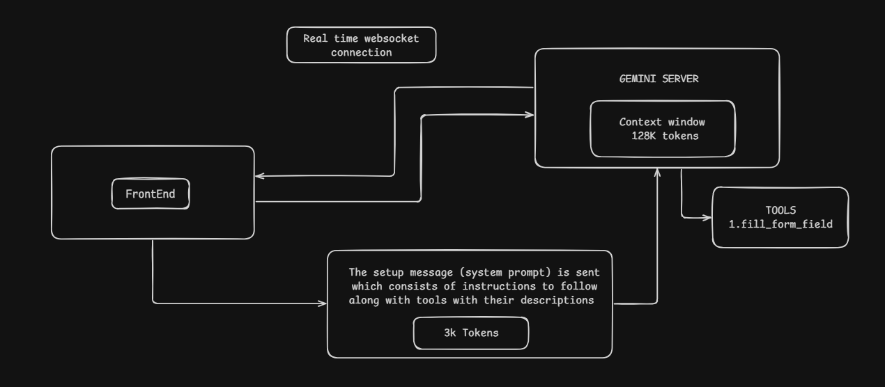

# formease

A real-time voice assistant that helps users fill out forms using voice commands and generate completed forms as PDF files. This voice agent is built using Gemini Live API for low-latency real-time audio streaming and function calling.

---

##  Features 

### Multilingual Voice Input:
- Currently Gemini Live supports 90+ languages. So the user can provide voice input in their preferred language and fill the form in English / preferred language. 
- People with physical disabilities can use this voice agent to fill forms with voice commands. 

### Downloadable PDF Output:
- Once all the form fields are filled, the user can download the filled form in PDF format.

### Intelligent Form Guidance:
- The voice agent can explain the form fields to the user if required and can guide them in filling the form.


---

##  WorkFlow 

### 1. Ephemeral Token Generation: 
The backend generates a short-lived ephemeral token via the Gemini REST API using the server-side API key. This token is passed to the client (FrontEnd) and used to authenticate the Websocket Session avoiding the exposure of the API key on the client side.

### 2. WebSocket Connection: 
When the mic is enabled a bidirectional WebSocket is established to Google's Gemini Live server. The WebSocket connection is established from the Client (FrontEnd) to the Gemini Live server.

### 3. Setup Message: 
Once the WebSocket connection is established a setup message (which includes system prompt and tool definitions) is sent. 

    Setup Message Consists of the following things:
    - Its job description and instructions to follow
    - Form fields that are available and need to be filled
    - Available tools and when to use those tools with the tool descriptions 



### 4. Real-Time Bidirectional Audio Streaming: 
When the user speaks audio chunks are streamed from the client to the server through WebSocket. Audio chunks from Gemini server are streamed back to the user through the WebSocket. 

### 5. Concurrent Audio & Tool Call Response: 
Gemini understands the user's intent and then calls the required tools. Gemini sends both audio and text as output. Audio is streamed back to the user through the WebSocket. The text output contains which tools to call with it's parameters. 

### 6. Client-Side Function Execution: 
The provided parameters are used to call the function and the output is sent back to the Gemini Server through the WebSocket if required and the UI is updated in real-time. 

### 7. End-to-End Example: Filling a Field: 
When the Agent asks [ What is your name ? ] . User replies [ My name is xyz ] . Gemini decides to call fill_form_fields tool and passes name as parameter with value xyz. The function is executed and the tool response is sent back to the Gemini Server and the UI state is updated in real time.


---

## Setup

### 1. Environment Variables

Create a `.env` file inside the `Backend/` directory:

```env
GEMINI_API_KEY=your_gemini_api_key_here
```

### 2. Backend Setup
```bash
cd Backend

npm install

npm run dev
```

### 3. Frontend Setup
```bash
cd Frontend

npm install

npm run dev
```
---

## Project Structure

```text
.
├── Backend
│   ├── controllers
│   │   ├── Form
│   │   │   ├── downloadAccountOpeningController.js
│   │   │   ├── downloadAdmissionController.js
│   │   │   ├── downloadControllers.js
│   │   │   └── downloadMedicalIntakscontroller.js
│   │   ├── formController.js
│   │   └── liveTokenController.js
│   ├── models
│   │   └── formFields.js
│   ├── routes
│   │   ├── FormRoute.js
│   │   └── LiveRoute.js
│   ├── template
│   │   └── templatePDFs
│   │       ├── accountopening-template.pdf
│   │       ├── admission-template.pdf
│   │       └── medical-intake-template.pdf
│   ├── .env
│   ├── package.json
│   └── server.js
├── Frontend
│   ├── public
│   ├── src
│   │   ├── assets
│   │   ├── components
│   │   │   ├── CheckboxGroupRow.jsx
│   │   │   ├── FormFieldRow.jsx
│   │   │   ├── FormReviewPanel.jsx
│   │   │   ├── Header.jsx
│   │   │   ├── Livewaveform.jsx
│   │   │   └── VoicePanel.jsx
│   │   ├── hooks
│   │   │   ├── useAudioPlayback.js
│   │   │   ├── useAudioRecorder.js
│   │   │   ├── useForm.js
│   │   │   ├── useFormFields.js
│   │   │   ├── useGeminiLive.js
│   │   │   └── useHomeGeminiLive.js
│   │   ├── utils
│   │   │   ├── audioUtils.js
│   │   │   └── waveformUtils.js
│   │   ├── App.jsx
│   │   ├── FormEaseMockup.jsx
│   │   ├── Home.jsx
│   │   ├── index.css
│   │   └── main.jsx
│   ├── index.html
│   ├── package.json
│   └── vite.config.js
└── README.md
```
